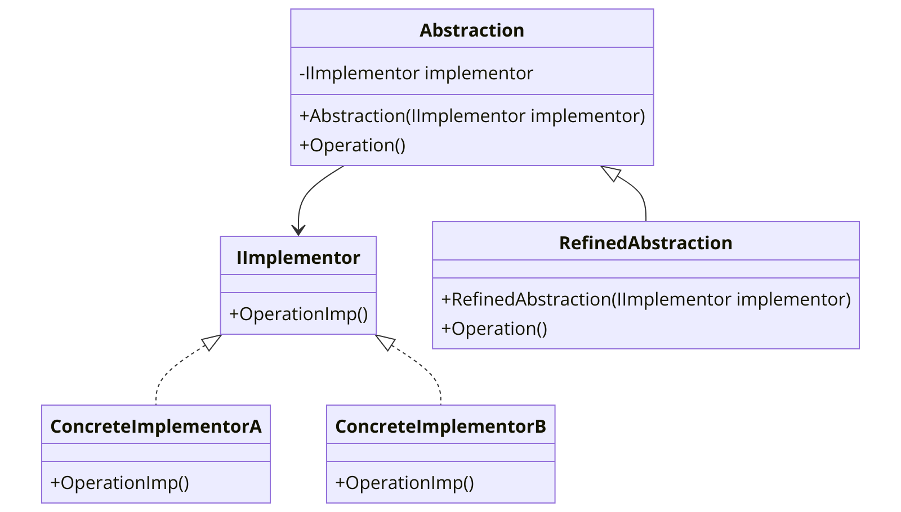



The Bridge pattern is a structural design pattern that decouples an abstraction from its implementation so that the two can vary independently. This pattern involves an interface which acts as a bridge which makes the functionality of concrete classes independent from interface implementer classes. Both types of classes can be altered structurally without affecting each other.

In the context of .NET programming, the Bridge pattern can be particularly useful due to the extensive use of interfaces and the strong typing of the language. It can help to separate the implementation details from the abstraction.


Here's a basic example of how the Bridge pattern might be implemented in C#:

```csharp
// The Abstraction
public abstract class Abstraction
{
    protected IImplementor implementor;

    public Abstraction(IImplementor implementor)
    {
        this.implementor = implementor;
    }

    public virtual void Operation()
    {
        implementor.OperationImp();
    }
}

// The Implementor
public interface IImplementor
{
    void OperationImp();
}

// Concrete Implementor A
public class ConcreteImplementorA : IImplementor
{
    public void OperationImp()
    {
        // Implementation A
    }
}

// Concrete Implementor B
public class ConcreteImplementorB : IImplementor
{
    public void OperationImp()
    {
        // Implementation B
    }
}

// Refined Abstraction
public class RefinedAbstraction : Abstraction
{
    public RefinedAbstraction(IImplementor implementor) : base(implementor)
    {
    }

    public override void Operation()
    {
        // Do something else before
        base.Operation();
        // Do something else after
    }
}
```

In this `Bridge` pattern example, `Abstraction` is the abstraction and `IImplementor` is the implementor. `ConcreteImplementorA` and `ConcreteImplementorB` are concrete implementors, and `RefinedAbstraction` is a refined abstraction. The `Abstraction` can operate with different `IImplementor` objects, which makes the system more flexible. The `RefinedAbstraction` can add more operations or override the existing ones.