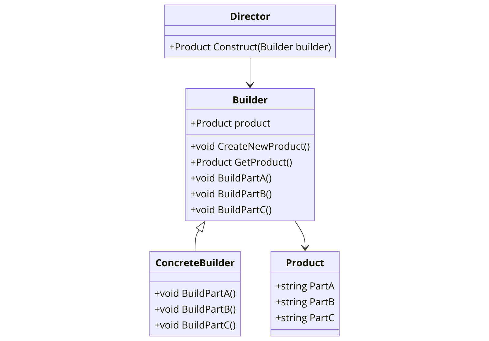

The Builder pattern is a creational design pattern that provides a solution to the telescoping constructor anti-pattern. The telescoping constructor anti-pattern occurs when the increase of object constructor parameter combination leads to an exponential list of constructors. Instead of using numerous constructors, the Builder pattern uses another object, a builder, that receives each initialization parameter step by step and then returns the resulting constructed object at once.

In the context of .NET programming, the Builder pattern can be particularly useful due to the strong typing of the language and the need for creating complex objects step by step.



Here's a basic example of how the Builder pattern might be implemented in C#:

```csharp
public class Product
{
    public string PartA { get; set; }
    public string PartB { get; set; }
    public string PartC { get; set; }
}

public abstract class Builder
{
    protected Product product;

    public void CreateNewProduct()
    {
        product = new Product();
    }

    public Product GetProduct()
    {
        return product;
    }

    public abstract void BuildPartA();
    public abstract void BuildPartB();
    public abstract void BuildPartC();
}

public class ConcreteBuilder : Builder
{
    public override void BuildPartA()
    {
        product.PartA = "Part A";
    }

    public override void BuildPartB()
    {
        product.PartB = "Part B";
    }

    public override void BuildPartC()
    {
        product.PartC = "Part C";
    }
}

public class Director
{
    public Product Construct(Builder builder)
    {
        builder.CreateNewProduct();
        builder.BuildPartA();
        builder.BuildPartB();
        builder.BuildPartC();
        return builder.GetProduct();
    }
}
```

In this example, `Product` is the complex object that needs to be created. `Builder` is the abstract base class that defines the steps to create a `Product`. `ConcreteBuilder` is a class that implements these steps to create a concrete `Product`. `Director` is the class that constructs an object using the `Builder` interface.