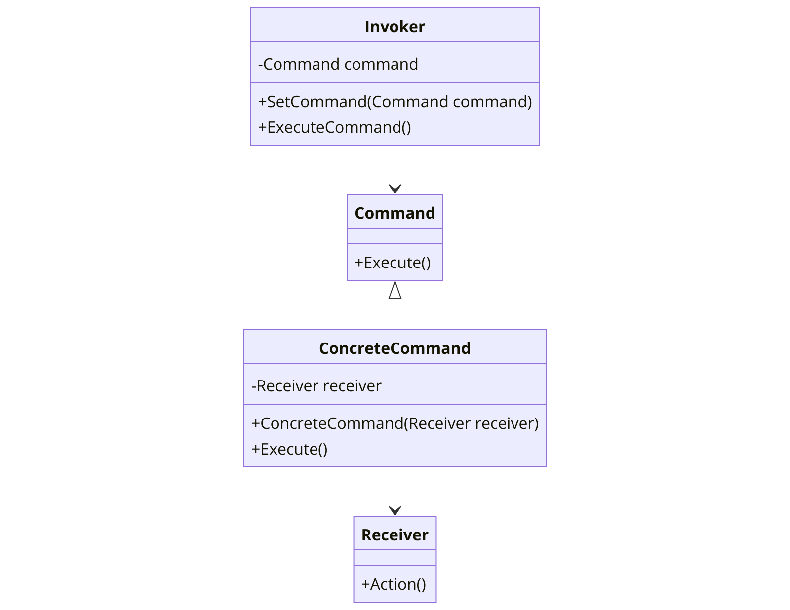

The Command pattern is a behavioral design pattern that turns a request into a stand-alone object that contains all information about the request. This transformation lets you pass requests as a method arguments, delay or queue a request's execution, and support undoable operations.



In the context of .NET programming, the Command pattern can be particularly useful due to the strong typing of the language and the need for encapsulating requests as objects.

Here's a basic example of how the Command pattern might be implemented in C#:

```csharp
// The Command abstract class
public abstract class Command
{
    public abstract void Execute();
}

// Concrete Command
public class ConcreteCommand : Command
{
    private readonly Receiver _receiver;

    public ConcreteCommand(Receiver receiver)
    {
        _receiver = receiver;
    }

    public override void Execute()
    {
        _receiver.Action();
    }
}

// The Receiver class
public class Receiver
{
    public void Action()
    {
        // Perform the action
    }
}

// The Invoker class
public class Invoker
{
    private Command _command;

    public void SetCommand(Command command)
    {
        _command = command;
    }

    public void ExecuteCommand()
    {
        _command.Execute();
    }
}
```

In this example, `Command` is the abstract base class, and `ConcreteCommand` is a concrete implementation of a command. `Receiver` is the class that performs the action when the command is executed. `Invoker` is the class that invokes commands. The `Invoker` can execute commands immediately or store them for later execution.