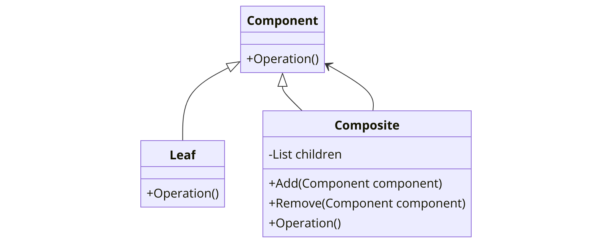

The Composite pattern is a structural design pattern that lets you compose objects into tree structures and then work with these structures as if they were individual objects. This pattern is particularly useful when dealing with a hierarchy of objects where you want to treat a group of objects and a single object in the same way.



In the context of .NET programming, the Composite pattern can be particularly useful due to the strong typing of the language and the need for handling complex hierarchical structures.

Here's a basic example of how the Composite pattern might be implemented in C#:

```csharp
// The Component abstract class
public abstract class Component
{
    public abstract void Operation();
}

// The Leaf class
public class Leaf : Component
{
    public override void Operation()
    {
        // Perform leaf-specific behavior
    }
}

// The Composite class
public class Composite : Component
{
    private readonly List<Component> _children = new List<Component>();

    public void Add(Component component)
    {
        _children.Add(component);
    }

    public void Remove(Component component)
    {
        _children.Remove(component);
    }

    public override void Operation()
    {
        foreach (var child in _children)
        {
            child.Operation();
        }
    }
}
```

In this example, `Component` is the abstract base class, `Leaf` represents the end objects of a composition and `Composite` is the class that has children components. The `Composite` class can add or remove components and it can perform an operation on all its children.