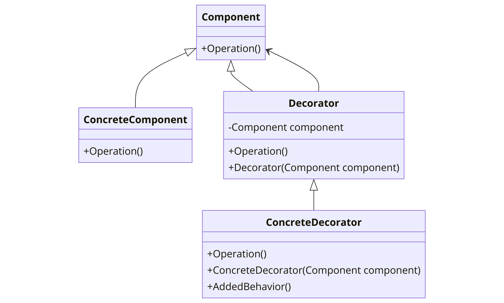

The Decorator pattern is a structural design pattern that allows behavior to be added to an individual object, either statically or dynamically, without affecting the behavior of other objects from the same class. This pattern is a flexible alternative to subclassing for extending functionality.



In the context of .NET programming, the Decorator pattern can be particularly useful due to the strong typing of the language and the need for extending an object's behavior without creating a high number of subclasses.

Here's a basic example of how the Decorator pattern might be implemented in C#:

```csharp
// The Component abstract class
public abstract class Component
{
    public abstract void Operation();
}

// The ConcreteComponent class
public class ConcreteComponent : Component
{
    public override void Operation()
    {
        // Original operation
    }
}

// The Decorator abstract class
public abstract class Decorator : Component
{
    protected Component component;

    public Decorator(Component component)
    {
        this.component = component;
    }

    public override void Operation()
    {
        component.Operation();
    }
}

// The ConcreteDecorator class
public class ConcreteDecorator : Decorator
{
    public ConcreteDecorator(Component component) : base(component)
    {
    }

    public override void Operation()
    {
        // Call the original operation, then add new behavior
        base.Operation();
        AddedBehavior();
    }

    private void AddedBehavior()
    {
        // New behavior
    }
}
```

In this example, `Component` is the abstract base class, `ConcreteComponent` is the original object that has some basic operation. `Decorator` is the abstract decorator class that implements the `Component` interface and has a HAS-A relationship with `Component`. `ConcreteDecorator` is the class that adds new behavior to the original operation.