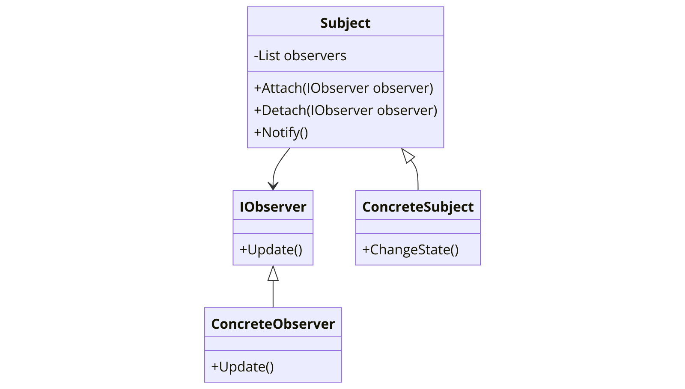

The Observer pattern is a behavioral design pattern that allows some objects to notify other objects about changes in their state. The Observer pattern provides a way to subscribe and unsubscribe to and from these notifications for multiple objects.



In the context of .NET programming, the Observer pattern can be particularly useful due to the strong typing of the language and the need for handling one-to-many dependencies between objects.

Here's a basic example of how the Observer pattern might be implemented in C#:

```csharp
// The Observer interface
public interface IObserver
{
    void Update();
}

// The Concrete Observer class
public class ConcreteObserver : IObserver
{
    public void Update()
    {
        // Perform an action in response to the update
    }
}

// The Subject abstract class
public abstract class Subject
{
    private List<IObserver> _observers = new List<IObserver>();

    public void Attach(IObserver observer)
    {
        _observers.Add(observer);
    }

    public void Detach(IObserver observer)
    {
        _observers.Remove(observer);
    }

    public void Notify()
    {
        foreach (var observer in _observers)
        {
            observer.Update();
        }
    }
}

// The Concrete Subject class
public class ConcreteSubject : Subject
{
    public void ChangeState()
    {
        // Change the state of the subject
        // ...

        // Notify all observers about the change
        Notify();
    }
}
```

In this `Observer` pattern example, `IObserver` is the observer interface, `ConcreteObserver` is a concrete observer that performs some action in response to the updates. `Subject` is the abstract subject class that maintains a list of observers and can notify them about the changes. `ConcreteSubject` is a concrete subject that changes its state and notifies all observers about this change.