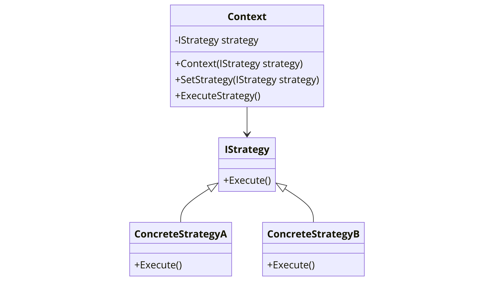

The Strategy pattern is a behavioral design pattern that allows you to define a family of algorithms, put each of them into a separate class, and make their objects interchangeable. It's particularly useful when you want to provide the user with a way to choose the algorithm at runtime.



In the context of .NET programming, the Strategy pattern can be particularly useful due to the strong typing of the language and the need for selecting an algorithm at runtime.

Here's a basic example of how the Strategy pattern might be implemented in C#:

```csharp
// The Strategy interface
public interface IStrategy
{
    void Execute();
}

// Concrete Strategies
public class ConcreteStrategyA : IStrategy
{
    public void Execute()
    {
        // Implement the algorithm using Strategy A
    }
}

public class ConcreteStrategyB : IStrategy
{
    public void Execute()
    {
        // Implement the algorithm using Strategy B
    }
}

// The Context class
public class Context
{
    private IStrategy _strategy;

    public Context(IStrategy strategy)
    {
        _strategy = strategy;
    }

    public void SetStrategy(IStrategy strategy)
    {
        _strategy = strategy;
    }

    public void ExecuteStrategy()
    {
        _strategy.Execute();
    }
}
```

In this `Strategy` pattern example, `IStrategy` is the strategy interface, `ConcreteStrategyA` and `ConcreteStrategyB` are concrete strategies that implement the `IStrategy` interface. `Context` is the class that uses a strategy. It can change the strategy at runtime with the `SetStrategy` method and can execute the strategy with the `ExecuteStrategy` method.